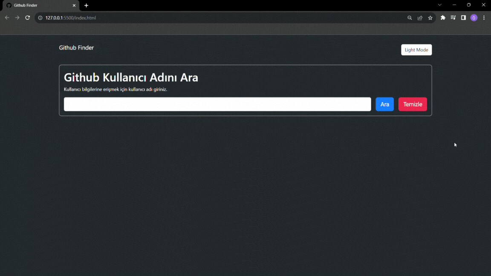

# Github Finder Project

- GitHub Finder projesi, kullanıcı tarafından girilen bir GitHub kullanıcı adını alıp, GitHub API'sına istek atarak o kullanıcının GitHub profil bilgilerini ve repolarını getirmektedir. Böylece kullanıcı, istediği GitHub kullanıcısının profiline ve repolarına kolayca erişebilir.

## Proje Özellikleri

- Yanlış, boş ya da doğru girilen kullanıcı adlarına göre ekranda bildirim oluşturur.

- Aydınlık ve karanlık mod kullanılmıştır.

## Kullanılan Teknolojiler

- HTML

- CSS

- Bootstrap

- JavaScript

## Gif

# Kaynaklar

- Api: api.github.com/users

- Api-key: https://github.com/settings/developers
